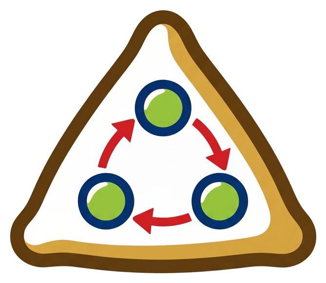

# SAMOSA

<table>
  <tr>
    <td></td>
    <td><strong>SAMOSA</strong> (Space-Aligned Multi-fidelity Open Sampling Architecture) is a Python package for MCMC sampling with multi-fidelity and coupled-chain support. Multi-fidelity MCMC (e.g. MLMC) features are included.</td>
  </tr>
</table>

[](https://github.com/sanjan-m/SAMOSA/actions/workflows/ci.yml)
[](https://www.python.org/downloads/)
[](LICENSE)

## Installation

Clone the repository and install in development mode:

```bash
git clone https://github.com/sanjan-m/SAMOSA.git
cd SAMOSA
pip install -r requirements.txt
pip install -e .
```

Core dependencies (numpy, scipy) are listed in `requirements.txt` and in `setup.py`. For running tests, use `pip install -e ".[test]"` (installs pytest).

### Optional: Transport maps

To use **transport maps** (`LowerTriangularMap`, `Normalizingflow`, `RealNVP` in `samosa.maps`), you need:

- **MParT** — [GitHub](https://github.com/MeasureTransport/MParT). Install with `pip install MParT` or `conda install -c conda-forge mpart`.
- **normflows** (and PyTorch) — [GitHub](https://github.com/VincentStimper/normalizing-flows). Install with `pip install normflows`.

You can install optional map dependencies with:

```bash
pip install -r requirements-maps.txt
```

(or `pip install -e ".[maps]"` if the package defines a `maps` extra).

## Quick start

```python
import numpy as np
from samosa import (
    GaussianRandomWalk,
    MetropolisHastingsKernel,
    SingleChainSampler,
)

def model(params):
    return {"log_posterior": float(-0.5 * np.sum(params**2))}

proposal = GaussianRandomWalk(mu=np.zeros((2, 1)), cov=0.1 * np.eye(2))
kernel = MetropolisHastingsKernel(model=model, proposal=proposal)
sampler = SingleChainSampler(kernel, initial_position=np.zeros((2, 1)), n_iterations=1000)
sampler.run("output")
```

## Package hierarchy

The `samosa/` package is organized as follows:

- **core/** — State (`ChainState`), model protocol, and proposal base classes: `ProposalBase`, `AdaptiveProposal`, `TransportProposalBase`. Also the transport map interface and MLMC utilities.

- **kernels/** — Transition kernels: `MetropolisHastingsKernel`, `DelayedRejectionKernel`.

- **proposals/** — Base proposals (e.g. `GaussianRandomWalk`), adapters (`HaarioAdapter`, `GlobalAdapter`), and wiring via `AdaptiveProposal`.

- **samplers/** — `SingleChainSampler` (and coupled / MLDA samplers for multi-level and coupling).

- **maps/** — Transport maps (`LowerTriangularMap`, `RealNVPMap`, `LinearOptimalTransportMap`) used with `TransportProposalBase`.

- **utils/** — `tools` (e.g. `laplace_approx`, `log_banana`) and `post_processing` (`load_samples`, `get_position_from_states`, `scatter_matrix`, `plot_trace`, `plot_lag`).

## Sampling strategy progression

Examples are ordered by increasing complexity:

1. **Simple** — Fixed proposal (e.g. Gaussian random walk), optionally tuned with a Laplace approximation at the MAP.
2. **Adaptation** — Same base proposal wrapped with an adapter (e.g. Haario or Global) so covariance or scale is adapted during the run.
3. **Delayed rejection** — After a rejected first stage, propose again (e.g. with scaled covariance) to improve acceptance.
4. **Transport maps** — Propose in a reference space (e.g. N(0,I)) and map back to the target; the map is often pre-adapted using samples from a previous run.

## Examples

- **single_chain** — Single-chain sampling on a banana posterior with several strategies (base, adaptation, delayed rejection, transport maps).
- **coupled_chain** — Coupled sampling with Independent, Maximal, and Synce coupling (including transport maps).
- **mlmcmc** — Multilevel MCMC: build kernels per level, run sampling, and estimate MLMC statistics.

## License

See [LICENSE](LICENSE).
